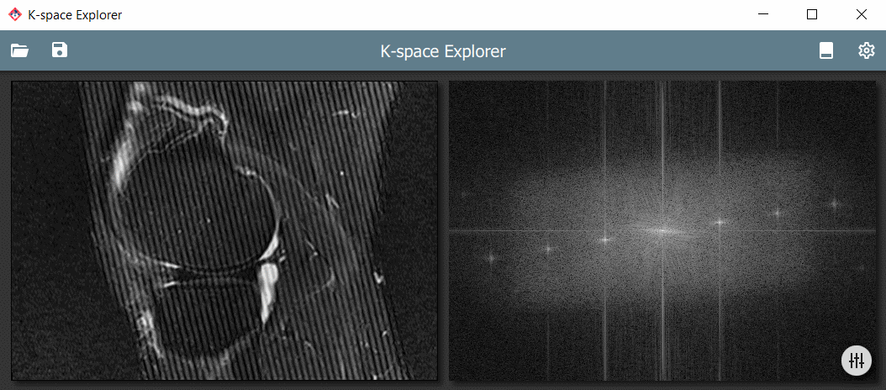
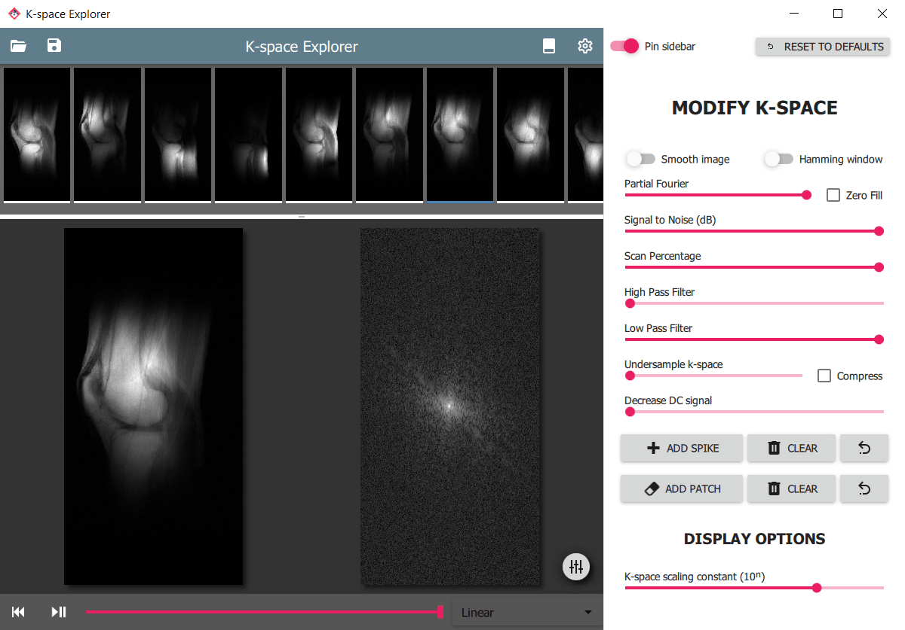
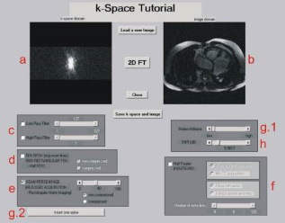

# K-space Explorer

**An educational tool to get hands-on experience with the k-space and the
effects of various modifications on the resulting image after an inverse
Fourier transform.**


K-space Explorer is written in Python 3 and uses open source libraries, so
it can be used for free and the source code can be inspected to peek under
the hood.

**To try some features of the desktop app, you can now visit the [K-Space Explorer Online](https://share.streamlit.io/birogeri/kspace-explorer-streamlit/kspace.py)**  
(this version is also on [GitHub](https://github.com/birogeri/kspace-explorer-streamlit))

The desktop app has many useful features, such as:

* A modern responsive user interface using Qt
* Automatic Fourier transform to instantaneously visualise changes
* Load your own images and analyse artefacts originating from k-space
* Short explanation for various functions within the software

---

☕ **This app was created in my spare time.**
If you find it useful please consider [buying me a coffee with PayPal](https://www.paypal.me/birogeri/5gbp) ☕

---


## **Contents**
* [Installation](#installation)
* [Starting the program](#starting-the-program)
* [Usage](#usage)
* [Troubleshooting](#troubleshooting)
* [Comparison to Other Similar Projects](#comparison-to-other-similar-projects)
* [Latest changes](#latest-changes)
* [Known bugs](#known-bugs)
* [Planned features](#planned-features)
* [Disclaimer and limitations](#disclaimer-and-limitations)
* [Author & Contributors](#author--contributors)
* [References](#references)


## **Installation**

1. You will need to have the following software and packages

    * **Python 3** (ideally the latest version). Download from the [Python 3 homepage](https://www.python.org/downloads).

2. Required Packages for Python 3:

    * **PyQt5**     - provides graphical user interface
    * **Pillow**    - opens regular images such as jpg or png
    * **NumPy**     - handles FFT transforms and array operations
    * **pydicom**   - DICOM format medical image reader

    Install via pip by copying the command below to a command prompt (Windows: `Win+R` and type `cmd` and press Enter)

    ```shell
        pip3 install numpy pydicom Pillow PyQt5
    ```

3. [Download the app](https://github.com/birogeri/kspace-explorer/archive/master.zip) and extract it

## Starting the program

Navigate to the folder that contains the extracted software and run it by typing the command below

``` shell
    python kspace.py
```

### Alternatively (on Windows)

To save you navigating on Windows, 
just open the folder where the app was extracted and:

* Click the address bar (the line that looks something 
like this: *"This PC > Downloads > kspace-explorer-master"*)
* Delete the address and type ```cmd``` and press Enter
* A window should appear, and you can now type ```python kspace.py```

---

## **Usage**

KSE automatically loads a default image, but you can
easily switch images by either:

* Clicking Open New Image  on the toolbar
* Pressing `Ctrl+O`
* Simply by drag and dropping a file or files

You can also load a prepared raw data file to view a multichannel image acquisition. Please refer to the relevant section for instructions.

|  |
|:--:|
| *A real-life herringbone artefact and the corresponding k-space* |

### **Accessing the k-space modifiers**

There are various modifiers available to edit the k-space and see the effects on the resulting image. These are accessible from the drawer panel on the right. To access it:

* Click and Drag inwards from the right side of the window
* Press the `Tab` key
* Click the round button  on the lower right side

### **Simulating image acquisition**

You can use the controls in the footer. The footer can be toggled by using the toolbar icon  or by hitting `F7`

* To start or continue the acquisition, press Play/Pause  or press `F5`
* To rewind press Rewind  or press ``F4``
* You can change the simulation mode with the dropdown box on right-hand side

### **Saving images**

Your modified images can be saved to your computer by either

* Pressing `Ctrl+S`
* Clicking Save  on the toolbar

Then select the location and the filename. Visual representation of the k-space and the corresponding image will be saved with *_k* and *_i* suffixes, respectively.

*Please note that if you select the tiff format, k-space image will be saved with 32-bit depth. This not handled well with many image viewers.*

### **Brightness/contrast and windowing**

To enhance certain parts of the image for viewing it is often useful to change the **brightness** or **contrast** of the displays.

* Hold the right mouse button and move up/down to change image or k-space brightness
* Hold the right mouse button and move left/right to change image contrast

With **windowing** it is possible to limit the displayed image pixel intensity range.

* Drag mouse left/right with middle mouse button pressed to change window width
* Drag mouse up/down with middle mouse button pressed to change window centre

### **Loading a raw data file**

K-space Explorer can load a specially prepared (simplified) raw data file, which can contain data from multiple coil elements.
An example file can be found in the `images` folder (obtained from [Harvard SMURF public domain repository](https://dataverse.harvard.edu/dataset.xhtml?persistentId=doi:10.7910/DVN/XNMCYI) [1]).

The raw data file can be loaded just like a normal image - drag & drop or using the Open New Image dialog.

|  |
|:--:|
| *Multi-channel raw data viewer interface of K-space Explorer* |

### **Expected raw data structure**

The raw data file is a simple 3D numpy array with [channel, rows, columns] arrangement. If the array is prepared in Python it can be saved to .npy file with the [numpy.save](https://numpy.org/doc/stable/reference/generated/numpy.save.html) function.

Raw data can be obtained from the scanner with differing methods and proprietary formats determined by the scanner vendor.
Siemens scanner raw data can be exported using [this tutorial](https://www.nmr.mgh.harvard.edu/~greve/siemens-raw-save.html). The .dat file can be processed in Python using the [twixtools package](https://github.com/mrphysics-bonn/twixtools) from the *German Center for Neurodegenerative Diseases within the Helmholtz Association (DZNE)*.

See the example script below on how to read the image data and save it to the format K-space explorer can handle.

#### **Example script to read Siemens raw data file and save it for K-space Explorer**

```python
import numpy as np
import twixtools

filename = "knee_TSE_V2_waterSat.dat"
save_as = "knee_kspace_explorer"


def import_kspace(mdb_list):
    # Function taken from twixtools documentation
    image_mdbs = []
    for mdb in mdb_list:
        if mdb.is_image_scan():
            image_mdbs.append(mdb)

    n_line = 1 + max([mdb.cLin for mdb in image_mdbs])
    n_part = 1 + max([mdb.cPar for mdb in image_mdbs])
    n_channel, n_column = image_mdbs[0].data.shape

    out = np.zeros([n_part, n_line, n_channel, n_column], dtype=np.complex64)
    for mdb in image_mdbs:
        out[mdb.cPar, mdb.cLin] += mdb.data

    return out


twix_data = import_kspace(twixtools.read_twix(filename)[-1]['mdb'])
extract_part0 = np.zeros((twix_data.shape[1:4]), dtype=np.dtype(np.complex64))
extract_part0[:, :, :] = twix_data[0, :, :, :]
# Reorder axis to [channel, row, column]
array_to_save = np.transpose(extract_part0, (1, 0, 2))
# Optional - rotate all channels by 90 degress
# array_to_save = np.rot90(array_to_save, 3, (1, 2))
np.save(save_as, array_to_save, allow_pickle=False)
```

---

## **Troubleshooting**

If the app does not behave as expected, 
you can [post issues here](https://github.com/birogeri/kspace-explorer/issues) with your GitHub account.

To help diagnose the problem, please try and run K-space Explorer with logging enabled.
To enable logging mode, run the app with the `--log` command line argument.

``` shell
    python kspace.py --log
```

The file `kspace.log` will be populated with debugging information.
You can then [upload the contents of the file here](https://gist.github.com/) 
and include a link to the published log in your issue.

---

## **Comparison to Other Similar Projects**

This app was directly influenced by the article of D. Moratal et al. [2], however my aim was to go beyond the functionality that it offers. Several similar software is available for different computing environments. Here is a non-exhaustive list of them:

* [k-Space Tutorial](https://www.ncbi.nlm.nih.gov/pmc/articles/PMC3097694/) (PC, Matlab) [2]
* [Journey through k-space](http://ww3.comsats.edu.pk/miprg/Downloads.aspx) (PC, Matlab) [3]
* [A k-Space Odyssey](https://www.kspace.info/) (iOS) [4]
* [K-Spapp](https://mrapps.jouwweb.nl/) (Android, free) [5]

|  |
|:--:|
|*A screenshot from k-Space Tutorial by D. Moratal et al.*|

### Software Requirements

 Matlab is a requirement for many similar apps. Matlab is proprietary software and can be costly to purchase a license.
 K-space Explorer only uses free software to make it more accessible.

### User Interface

The aim of K-space Explorer is to provide a smooth, modern UI with familiar tools and instant response whenever possible. Updates happen real time so immediate feedback is given for the effect of the changes.

### Free and Open Source

To get a deeper understanding of the inner workings the code can be inspected. In-line documentation can help in the understanding of the mathematical principles behind various interactions.

---

## Latest changes

* Basic logging
* View raw data with images from a multichannel acquisition

## Known bugs

* RGB DICOMs are not supported

## Planned features

* Accelerated scanning method simulation (SENSE, GRAPPA, POCS)
* Multiple languages
* CLAHE enhancement

## Disclaimer and limitations

This software is not intended for medical use.
Even if a scanner original DICOM file is used, the resulting k-space is not equivalent
to the scanner raw data as it contains all post-acquisition modifications
applied by the scanner software.

## Author & Contributors

|  |
|:--:|
| [Gergely Biró](https://www.linkedin.com/in/gergelybiro) |


## References

```references
    [1] Bachrata, Beata, 2020, "SMURF (raw MRI data)", https://doi.org/10.7910/DVN/XNMCYI, Harvard Dataverse, V3
    
    [2] Moratal, D., Vallés-Luch, A., Martí-Bonmati, L., & Brummers, M. E. (2008). k-Space tutorial: An MRI educational tool for a better understanding of k-space. Biomedical Imaging and Intervention Journal, 4(1). https://doi.org/10.2349/biij.4.1.e15

    [3] Qureshi, M., Kaleem, M., & Omer, H. (2017). Journey through k-space: An interactive educational tool. Biomedical Research (India), 28(4), 1618–1623.

    [4] Ridley, E. L. (21/03/2017). Mobile App Spotlight: A k-Space Odyssey. Source: AuntMinnie.com: https://www.auntminnie.com/index.aspx?sec=sup&sub=mri&pag=dis&ItemID=116900&wf=7612

    [5] K-Spapp - https://mrapps.jouwweb.nl/
    
```
